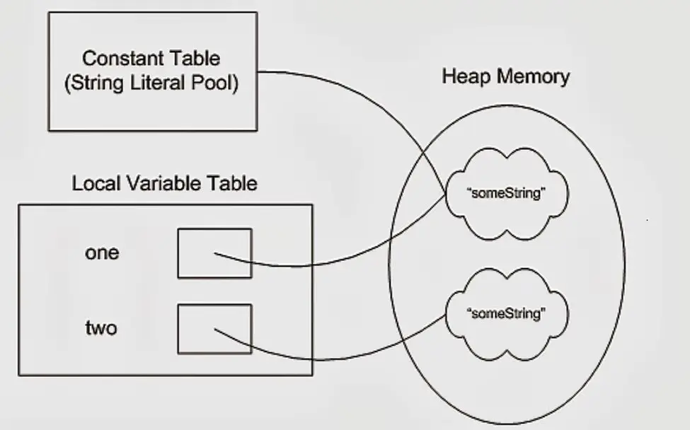

### 1、包装类型的缓存机制了解么？
Java 基本数据类型的包装类型的大部分都用到了缓存机制来提升性能:`Byte`,`Short`,`Integer`,`Long` 
这 4 种包装类默认创建了数值 **[-128，127]** 的相应类型的缓存数据，`Character` 创建了数值在 **[0,127]** 范围的缓存数据，
`Boolean` 直接返回 `True` or `False`。


### 2、自动装箱与拆箱了解吗？原理是什么？
**什么是自动拆装箱？**
- **装箱**：将基本类型用它们对应的引用类型包装起来；
- **拆箱**：将包装类型转换为基本数据类型；
- 从字节码中，我们发现装箱其实就是调用了 包装类的`valueOf()`方法，拆箱其实就是调用了 `xxxValue()`方法。


### 3、为什么浮点数运算的时候会有精度丢失的风险？
这个和计算机保存浮点数的机制有很大关系。我们知道计算机是二进制的，而且计算机在表示一个数字时，宽度是有限的，无限循环的小数存储在计算机时，
只能被截断，所以就会导致小数精度发生损失的情况。这也就是解释了为什么浮点数没有办法用二进制精确表示。
就比如说十进制下的 0.2 就没办法精确转换成二进制小数：
```java
// 0.2 转换为二进制数的过程为，不断乘以 2，直到不存在小数为止，
// 在这个计算过程中，得到的整数部分从上到下排列就是二进制的结果。
0.2 * 2 = 0.4 -> 0
0.4 * 2 = 0.8 -> 0
0.8 * 2 = 1.6 -> 1
0.6 * 2 = 1.2 -> 1
0.2 * 2 = 0.4 -> 0（发生循环）
...
```

### 4、静态变量有什么作用？
静态变量也就是被 `static` 关键字修饰的变量。它可以被类的所有实例共享，无论一个类创建了多少个对象，它们都共享同一份静态变量。也就是说，
静态变量只会被分配一次内存，即使创建多个对象，这样可以节省内存。
静态变量是通过类名来访问的，例如`StaticVariableExample.staticVar`（如果被 `private`关键字修饰就无法这样访问了）。


### 5、静态方法为什么不能调用非静态成员?
这个需要结合 JVM 的相关知识，主要原因如下：
1. 静态方法是属于类的，在类加载的时候就会分配内存，可以通过类名直接访问。而非静态成员属于实例对象，只有在对象实例化之后才存在，需要通过类的实例对象去访问。
2. 在类的非静态成员不存在的时候静态方法就已经存在了，此时调用在内存中还不存在的非静态成员，属于非法操作。
### 6、重载和重写有什么区别？
> 重载就是同样的一个方法能够根据输入数据的不同，做出不同的处理
> 重写就是当子类继承自父类的相同方法，输入数据一样，但要做出有别于父类的响应时，你就要覆盖父类方法
#### 重载
发生在同一个类中（或者父类和子类之间），方法名必须相同，参数类型不同、个数不同、顺序不同，方法返回值和访问修饰符可以不同。
《Java 核心技术》这本书是这样介绍重载的：
> 如果多个方法(比如 `StringBuilder` 的构造方法)有相同的名字、不同的参数， 便产生了重载。
>
> ```java
> StringBuilder sb = new StringBuilder();
> StringBuilder sb2 = new StringBuilder("HelloWorld");
> ```
综上：重载就是同一个类中多个同名方法根据不同的传参来执行不同的逻辑处理。
#### 重写

重写发生在运行期，是子类对父类的允许访问的方法的实现过程进行重新编写。

1. 方法名、参数列表必须相同，子类方法返回值类型应比父类方法返回值类型更小或相等，抛出的异常范围小于等于父类，访问修饰符范围大于等于父类。
2. 如果父类方法访问修饰符为 `private/final/static` 则子类就不能重写该方法，但是被 `static` 修饰的方法能够被再次声明。
3. 构造方法无法被重写

#### 总结

综上：**重写就是子类对父类方法的重新改造，外部样子不能改变，内部逻辑可以改变。**

⭐️ 关于 **重写的返回值类型** 这里需要额外多说明一下，上面的表述不太清晰准确：如果方法的返回类型是 void 和基本数据类型，则返回值重写时不可修改。但是如果方法的返回值是引用类型，重写时是可以返回该引用类型的子类的。
### 7、接口和抽象类有什么共同点和区别？

**共同点**：

- 都不能被实例化。
- 都可以包含抽象方法。
- 都可以有默认实现的方法（Java 8 可以用 `default` 关键字在接口中定义默认方法）。

**区别**：

- 接口主要用于对类的行为进行约束，你实现了某个接口就具有了对应的行为。抽象类主要用于代码复用，强调的是所属关系。
- 一个类只能继承一个类，但是可以实现多个接口。
- 接口中的成员变量只能是 `public static final` 类型的，不能被修改且必须有初始值，而抽象类的成员变量默认 default，可在子类中被重新定义，也可被重新赋值。
### 8、深拷贝和浅拷贝区别了解吗？什么是引用拷贝？
关于深拷贝和浅拷贝区别，我这里先给结论：
- **浅拷贝**：浅拷贝会在堆上创建一个新的对象（区别于引用拷贝的一点），不过，如果原对象内部的属性是引用类型的话，浅拷贝会直接复制内部对象的引用地址，也就是说拷贝对象和原对象共用同一个内部对象。
- **深拷贝**：深拷贝会完全复制整个对象，包括这个对象所包含的内部对象。

### 9、hashCode() 有什么用？
`hashCode()` 的作用是获取哈希码（`int` 整数），也称为散列码。这个哈希码的作用是确定该对象在哈希表中的索引位置。

### 10、10个最难回答的Java面试题
> 这是官方的介绍：<https://segmentfault.com/a/1190000019962661> 。

#### 为什么 wait，notify 和 notifyAll 是在 Object 类中定义的而不是在 Thread 类中定义？
1) wait 和 notify 不仅仅是普通方法或同步工具，更重要的是它们是 Java 中两个线程之间的通信机制。对语言设计者而言, 
 如果不能通过 Java 关键字(例如 synchronized)实现通信此机制，同时又要确保这个机制对每个对象可用, 
 那么 Object 类则是的合理的声明位置。记住同步和等待通知是两个不同的领域，不要把它们看成是相同的或相关的。
 同步是提供互斥并确保 Java 类的线程安全，而 wait 和 notify 是两个线程之间的通信机制。
2) 每个对象都可上锁，这是在 Object 类而不是 Thread 类中声明 wait 和 notify 的另一个原因。

3) 在 Java 中，为了进入代码的临界区，线程需要锁定并等待锁，他们不知道哪些线程持有锁，而只是知道锁被某个线程持有， 
并且需要等待以取得锁, 而不是去了解哪个线程在同步块内，并请求它们释放锁。

4) Java 是基于 Hoare 的监视器的思想(http://en.wikipedia.org/wiki/...。在Java中，所有对象都有一个监视器。

线程在监视器上等待，为执行等待，我们需要2个参数：
一个线程
一个监视器(任何对象)
在 Java 设计中，线程不能被指定，它总是运行当前代码的线程。但是，我们可以指定监视器(这是我们称之为等待的对象)。这是一个很好的设计，
因为如果我们可以让任何其他线程在所需的监视器上等待，这将导致“入侵”，影响线程执行顺序，导致在设计并发程序时会遇到困难。请记住，
在 Java 中，所有在另一个线程的执行中造成入侵的操作都被弃用了(例如 Thread.stop 方法)。 

#### 为什么Java中不支持多重继承？
1) 第一个原因是围绕钻石💎形继承问题产生的歧义，考虑一个类 A 有 foo() 方法, 然后 B 和 C 派生自 A, 
并且有自己的 foo() 实现，现在 D 类使用多个继承派生自 B 和C，如果我们只引用 foo(), 
编译器将无法决定它应该调用哪个 foo()。这也称为 Diamond 问题，因为这个继承方案的结构类似于菱形，见下图:

````                  A foo()    
               / \    
             /     \    
 foo() B     C foo()    
             \     /    
               \ /    
               D  foo()
  ````
    即使我们删除钻石的顶部 A 类并允许多重继承，我们也将看到这个问题含糊性的一面。如果你把这个理由告诉面试官，
    他会问为什么 C++ 可以支持多重继承而 Java不行。嗯，在这种情况下，我会试着向他解释我下面给出的第二个原因，
    它不是因为技术难度, 而是更多的可维护和更清晰的设计是驱动因素, 虽然这只能由 Java 言语设计师确认，
    我们只是推测。维基百科链接有一些很好的解释，说明在使用多重继承时，由于钻石问题，不同的语言地址问题是如何产生的。

2) 对我来说第二个也是更有说服力的理由是，多重继承确实使设计复杂化并在强制转换、构造函数链接等过程中产生问题。
假设你需要多重继承的情况并不多，简单起见，明智地决定是省略它。此外，Java 可以通过使用接口支持单继承来避免这种歧义。
由于接口只有方法声明而且没有提供任何实现，因此只有一个特定方法的实现，因此不会有任何歧义。


#### 为什么Java不支持运算符重载？
另一个类似的 Java 面试难题。为什么 C++ 支持运算符重载而 Java 不支持? 有人可能会说 + 运算符在 Java 中已被重载用于字符串连接，
不要被这些论据所欺骗。

与 C++ 不同，Java 不支持运算符重载。Java 不能为程序员提供自由的标准算术运算符重载，例如+， - ，*和/等。
如果你以前用过 C++，那么 Java 与 C++ 相比少了很多功能，例如 Java 不支持多重继承，Java中没有指针，
Java中没有地址引用传递。另一个类似的问题是关于 Java 通过引用传递，这主要表现为 Java 是通过值还是引用传参。
虽然我不知道背后的真正原因，但我认为以下说法有些道理，为什么 Java 不支持运算符重载。

1) 简单性和清晰性。清晰性是Java设计者的目标之一。设计者不是只想复制语言，而是希望拥有一种清晰，真正面向对象的语言。
添加运算符重载比没有它肯定会使设计更复杂，并且它可能导致更复杂的编译器, 或减慢 JVM，因为它需要做额外的工作来识别运算符的实际含义，
并减少优化的机会, 以保证 Java 中运算符的行为。

2) 避免编程错误。Java 不允许用户定义的运算符重载，因为如果允许程序员进行运算符重载，将为同一运算符赋予多种含义，
这将使任何开发人员的学习曲线变得陡峭，事情变得更加混乱。据观察，当语言支持运算符重载时，编程错误会增加，
从而增加了开发和交付时间。由于 Java 和 JVM 已经承担了大多数开发人员的责任，如在通过提供垃圾收集器进行内存管理时，
因为这个功能增加污染代码的机会, 成为编程错误之源, 因此没有多大意义。

3) JVM复杂性。从JVM的角度来看，支持运算符重载使问题变得更加困难。通过更直观，更干净的方式使用方法重载也能实现同样的事情，
因此不支持 Java 中的运算符重载是有意义的。与相对简单的 JVM 相比，复杂的 JVM 可能导致 JVM 更慢，
并为保证在 Java 中运算符行为的确定性从而减少了优化代码的机会。

4) 让开发工具处理更容易。这是在 Java 中不支持运算符重载的另一个好处。省略运算符重载后使语言更容易处理，
如静态分析等，这反过来又更容易开发处理语言的工具，例如 IDE 或重构工具。Java 中的重构工具远胜于 C++。


#### 为什么 String 被设计为是不可变的？
> 这是官方的介绍：<https://zhuanlan.zhihu.com/p/463840081> 。

1) 想象字符串池没有使字符串不可变，它根本不可能，因为在字符串池的情况下，一个字符串对象/文字，例如 “Test” 已被许多参考变量引用，
因此如果其中任何一个更改了值，其他参数将自动受到影响，即假设
````
    String A="Test";
    String B="Test";
````

2) 字符串已被广泛用作许多 Java 类的参数，例如，为了打开网络连接，你可以将主机名和端口号作为字符串传递，
你可以将数据库 URL 作为字符串传递, 以打开数据库连接，你可以通过将文件名作为参数传递给 File I/O 类来打开 Java 中的任何文件。
如果 String 不是不可变的，这将导致严重的安全威胁，我的意思是有人可以访问他有权授权的任何文件，
然后可以故意或意外地更改文件名并获得对该文件的访问权限。由于不变性，你无需担心这种威胁。这个原因也说明了，
为什么 String 在 Java 中是最终的，通过使 java.lang.String final，Java设计者确保没有人覆盖 String 类的任何行为。
3) 由于 String 是不可变的，它可以安全地共享许多线程，这对于多线程编程非常重要. 并且避免了 Java 中的同步问题，
不变性也使得String 实例在 Java 中是线程安全的，这意味着你不需要从外部同步 String 操作。
关于 String 的另一个要点是由截取字符串 SubString 引起的内存泄漏，这不是与线程相关的问题，但也是需要注意的。

4) 为什么 String 在 Java 中是不可变的另一个原因是允许 String 缓存其哈希码，Java 中的不可变 String 缓存其哈希码，并且不会在每次调用 String 的 hashcode 方法时重新计算，这使得它在 Java 中的 HashMap 中使用的 HashMap 键非常快。简而言之，因为 String 是不可变的，所以没有人可以在创建后更改其内容，这保证了 String 的 hashCode 在多次调用时是相同的。

5) String 不可变的绝对最重要的原因是它被类加载机制使用，因此具有深刻和基本的安全考虑。如果 String 是可变的，加载“java.io.Writer” 的请求可能已被更改为加载 “mil.vogoon.DiskErasingWriter”. 安全性和字符串池是使字符串不可变的主要原因。顺便说一句，上面的理由很好回答另一个Java面试问题: “为什么String在Java中是最终的”。要想是不可变的，你必须是最终的，这样你的子类不会破坏不变性。你怎么看？

#### 为什么 char 数组比 Java 中的 String 更适合存储密码？
1) 由于字符串在 Java 中是不可变的，如果你将密码存储为纯文本，它将在内存中可用，直到垃圾收集器清除它. 并且为了可重用性，会存在 String 在字符串池中, 它很可能会保留在内存中持续很长时间，从而构成安全威胁。
   由于任何有权访问内存转储的人都可以以明文形式找到密码，这是另一个原因，你应该始终使用加密密码而不是纯文本。由于字符串是不可变的，所以不能更改字符串的内容，因为任何更改都会产生新的字符串，而如果你使用char[]，你就可以将所有元素设置为空白或零。因此，在字符数组中存储密码可以明显降低窃取密码的安全风险。
2) Java 本身建议使用 JPasswordField 的 getPassword() 方法，该方法返回一个 char[] 和不推荐使用的getTex() 方法，该方法以明文形式返回密码，由于安全原因。应遵循 Java 团队的建议, 坚持标准而不是反对它。
3) 使用 String 时，总是存在在日志文件或控制台中打印纯文本的风险，但如果使用 Array，则不会打印数组的内容而是打印其内存位置。虽然不是一个真正的原因，但仍然有道理。


